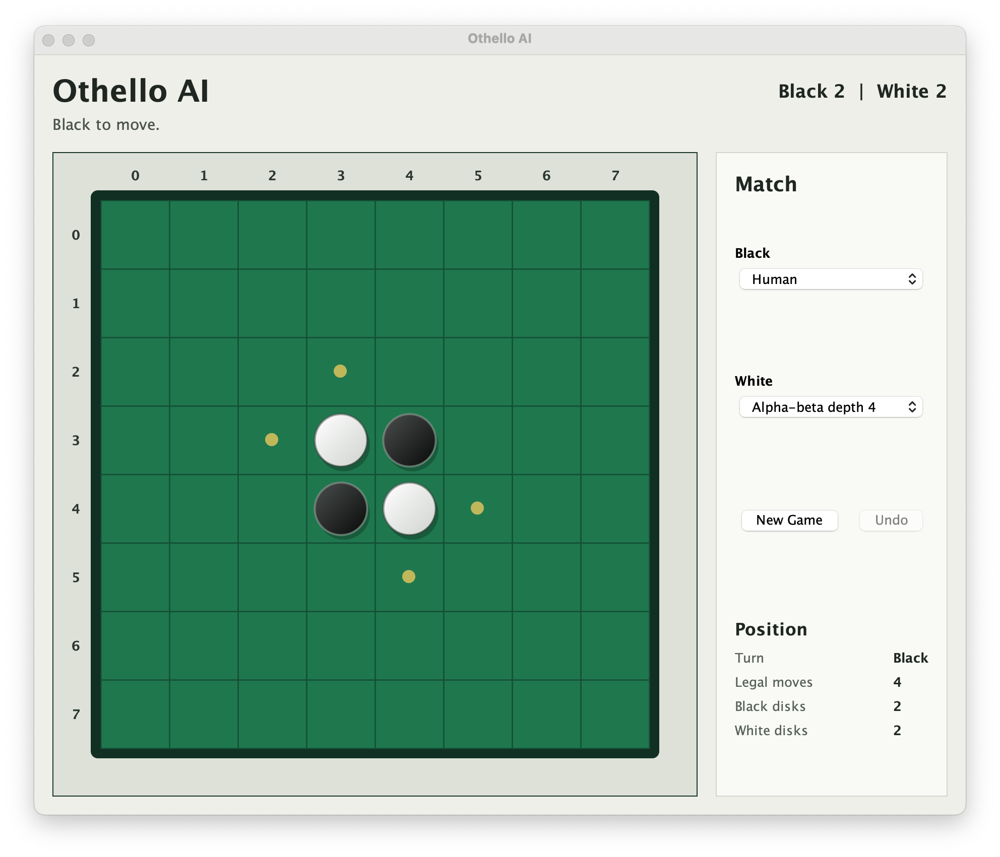
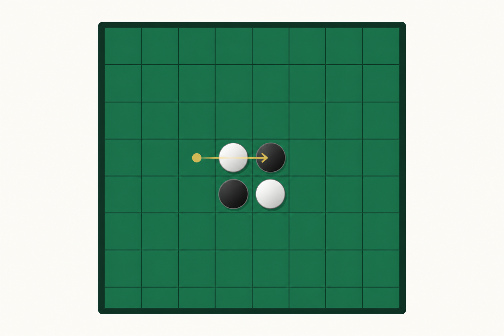
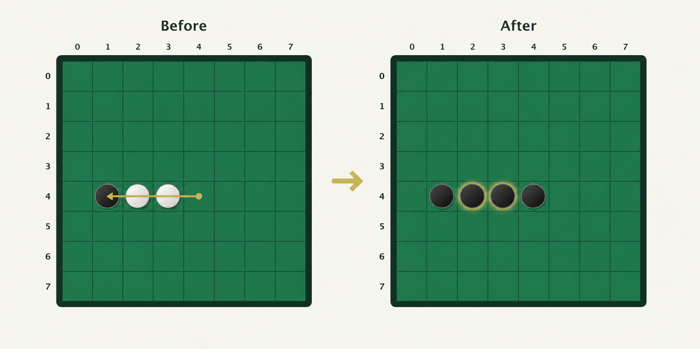

# Othello

  
  


<p align="center">
  
</p>

## Table of Contents

- [About](#about)
- [Tools Used](#tools-used)
- [Background: Othello](#background-othello)
  - [Objective](#objective)
  - [Board and Coordinates](#board-and-coordinates)
  - [Legal Moves](#legal-moves)
  - [Disk Flipping](#disk-flipping)
  - [Passing and End Conditions](#passing-and-end-conditions)
- [Minimax Search and Alpha-Beta Pruning](#minimax-search-and-alpha-beta-pruning)
  - [Othello as an Adversarial Search Problem](#othello-as-an-adversarial-search-problem)
  - [Minimax Search](#minimax-search)
  - [Alpha-Beta Pruning](#alpha-beta-pruning)
  - [Heuristic Evaluation](#heuristic-evaluation)
  - [Supported Strategies](#supported-strategies)
- [Project Architecture](#project-architecture)
  - [System Overview](#system-overview)
  - [Code Organization](#code-organization)
  - [Model Layer](#model-layer)
  - [AI Layer](#ai-layer)
  - [Interface Layer](#interface-layer)
  - [Testing](#testing)
- [Building and Running](#building-and-running)
  - [Requirements](#requirements)
  - [Build](#build)
  - [Run the GUI](#run-the-gui)
  - [Run the CLI](#run-the-cli)
  - [Run Simulations](#run-simulations)
  - [Run Tests](#run-tests)
  - [Clean Build Output](#clean-build-output)
- [Future Work](#future-work)
- [Acknowledgments](#acknowledgments)

---

## About

A Java native implementation of Othello, trademark Reversi. The code supports a GUI with options for both human and computer players. The computer player implements 4 algorithms. Minimax depth 2, Alpha Beta depth 3,  Alpha Beta depth 4, and Alpha Beta depth 5. There is also an option for "Random" which "randomly" selects from 1 of these 4. The computer can play against itself or against a human player.

Originally created for the course CSCI 5511 (Artificial Intelligence I) at University of Minnesota Twin Cities. I took this course during the third year of my undergrad. I was noted for being the only student in the course who used Java for the projects. Everyone else used Python. I preferred Java due to, what I perceive as, its more explicit rules and sublime logic. 

I was also the only student to create GUI's for all my projects. I did this because I enjoy visuals and to challenge myself. 

---

## Tools Used

- **Programming language**: Java
- **GUI toolkit**: Java Swing
- **Build tooling**: `make`, `javac`
- **AI (Search) Algorithms**: minimax search, alpha-beta pruning, heuristic board evaluation
- **Testing approach**: lightweight Java test harness with assertions implemented in code
- **Supported runtime**: JDK 8 or newer

No JavaFX, Maven, Gradle, or third-party libraries are required.

---
## Background : Othello

### Objective
Othello –– Also known as Reversi –– is a 2 player strategy game played on an 8x8 board with disks that are black on one side and white on the other.<br>

The game begins with 4 disks in the center of the board (2 black and 2 white). Black moves first. Players take turns placing disks on the empty squares with their color facing up. The objective is to finish the game with more disks showing your color than your opponent’s.

### Board and Coordinates
The board contains 64 squares arranged in eight rows and eight columns. In my GUI columns are labeled **A-H**, and rows are labeled **1-8**. A square can easily be identified by a coordinate such as **D3** or **F5**.<br>

Disks can be captured along any of the eight directions extending from a square:<br>
+ Horizontally
+ Vertically
+ Diagonally

### Legal Moves
On each turn, a player places one disk on an empty square. A move is legal only if it captures at least one opposing disk.<br>

To make a capture, the newly placed disk and another disk of the current player’s color must surround an uninterrupted line of one or more opposing disks. A single move may capture disks in multiple directions.<br>

If placing a disk would not capture any opposing disks, the move is illegal.<br>

<p align="center">
  
</p>

<p align="center">
  <em>A legal move must bracket at least one opposing disk in a horizontal, vertical, or diagonal line.</em>
</p>

### Disk Flipping
After a legal move is made, every captured disk is flipped to the current player’s color. Flipping occurs in every direction where opposing disks have been enclosed.<br>

For example, if Black places a disk at one end of a line containing one or more White disks followed by another Black disk, all enclosed White disks are flipped to Black.<br>

<p align="center">
  
</p>

<p align="center">
  <em>After a legal move, every captured disk is flipped to the current player's color.</em>
</p>

### Passing and End Conditions
If a player has no legal moves, they must pass their turn. The game continues with the other player if that player has at least one legal move.<br>

The game ends when neither player can make a legal move. This usually occurs when the board is full, although the game may end earlier.<br>

Each player then counts the disks showing their color. The player with the most disks wins. If both players have the same number of disks, the game ends in a draw.

**TODO:** Link the Othello rules doc I have saved on my old laptop.

---
## Minimax Search and Alpha-Beta Pruning

### Othello as an Adversarial Search Problem
Othello is a classic example of an adversarial search problem. The 2 players have directly opposing goals. The board state is fully observable, and every move changes the set of future options available to both sides.<br>

This search problem can be modeled using the standard components. Implementation code can be viewed under `src/model`.
+ **State**: The current board configuration and the current player stored by Game (e.g., the player to move).
+ **Actions**: All legal disk placements for the current player. Returned by `Board.lrgalMoves(color)`.
+ **Transition Function**: place a disk and flip all bracketed opponent disks.
+ **Terminal Test**: the board is full or neither player has a legal move.
+ **Utility**: win, loss, draw, or disk differential at terminal states.<br>

The full game tree is too large to search exhaustively during normal play. Instead the computer player searches to a fixed depth and then evaluates the frontier positions using a heuristic function.

### Minimax Search
This is a perfect case for some minimax search. The **Minimax algorithm** recursively explores the game tree to determine the "best" move.

### Alpha-Beta Pruning

### Heuristic Evaluation
The evaluation function lives in [`src/model/Heuristics.java`](src/model/Heuristics.java). It scores a board from the perspective of a given color.

If the position is terminal, the heuristic returns a large disk-differential score:

```text
terminal score = disk differential * 100000
```

For non-terminal positions, the heuristic combines several strategic signals:

| Feature | Why it matters |
| --- | --- |
| Mobility | Compares how many legal moves the player has against the opponent. |
| Coin parity | Compares disk counts. This receives more weight near the endgame. |
| Corner control | Corners are stable because they cannot be flipped once taken. |
| Positional weights | Uses a static 8x8 table where corners are highly valuable and risky squares near corners are penalized. |
| Frontier disks | Disks adjacent to empty squares are often vulnerable. |

The current weighted evaluation is:

```text
score =
    coinWeight * coinParity
  + 85 * mobility
  + 275 * corners
  + 8 * positional
  + 15 * frontier
```

The `coinWeight` changes based on the number of empty squares. When fewer than 16 empty squares remain, coin parity becomes more important; otherwise, mobility, corners, positional strength, and frontier exposure carry more of the evaluation.

This matters because raw disk count alone is often misleading in Othello. Early in the game, having more disks can be a weakness if those disks are unstable or give the opponent more legal moves.
### Supported Strategies

---

## Project Architecture

### System Overview
This project is organized around a shared Othello game model. The GUI, CLI, simulations, and tests all use the same underlying rules engine, so move validation and game behavior stay consistent across every entry point.<br>

At a high level:

```text
GUI / CLI / Tests
        |
        v
Game
        |
        v
Board + Move
        |
        v
Player implementations
        |
        v
ComputerPlayer + Heuristics
```

### Code Organization

.
|-- assets
|   `-- images
|       `-- othello-gui.png
|-- Makefile
|-- README.md
`-- src
    |-- cli
    |   `-- Main.java
    |-- logic
    |   |-- MoveGenerator.java
    |   `-- MoveLogic.java
    |-- model
    |   |-- Board.java
    |   |-- ComputerPlayer.java
    |   |-- Game.java
    |   |-- Heuristics.java
    |   |-- HumanPlayer.java
    |   |-- Move.java
    |   |-- Player.java
    |   `-- RandomPlayer.java
    |-- test
    |   `-- OthelloRulesTest.java
    `-- ui
        |-- Main.java
        |-- OptionPanel.java
        |-- OthelloBoard.java
        `-- OthelloWindow.java
```
### Model Layer

### AI Layer

### Interface Layer

### Testing

## Building and Running
### Requirements
This project requires Java Development Kit (JDK) 8 or newer.<br>

This project does not require Maven, Gradle, JavaFX or any other third party libraries.<br>

To check that Java is available you can use<br>

```bash
java -version
javac -version
```

### Build
To build you can simply use `make`. The project includes a provided [`Makefile`](Makefile).<br>

From the repository root simply run `make build`.<br>

The build target compiles every `.java` file under `src/` into the `out/` directory using `javac -Xlint:all`.<br>

If for some reason you do not want to use `make` the equivalent command is<br>

```bash
mkdir -p out
javac -Xlint:all -d out $(find src -name "*.java")
```

**NOTE:** Jacks recommendation is to use the provided Makefile.

### Run the GUI
To run the GUI you can simply use `make gui`. This will build the project and launch the Swing GUI through `src/ui/Main.java`.<br>

The GUI supports human players, random players, minimax (computer) players, and alpha-beta (computer) players with several depths.

### Run the CLI
To run the CLI you can simply use `make cli`. This builds the project and launches the command line version through `src/cli/Main.java`.<br>

In interactive CLI mode, moves are entered as row-column pairs. `2 3`. Rows and columns are zero-indexed in the CLI.<br>

**Note:** CLI is boring. Use the GUI version.

### Run Simulations
This project also supports simulations. Simulation mode runs complete games between automated players. Run simulations using:<br>

```bash
make build
java -cp out cli.Main --simulate 10 --black alphabeta:5 --white alphabeta:4
```

Supported player values are:<br>
+ `human`
+ `random`
+ `minimax:N`
+ `ai:N`
+ `alphabeta:N`

Examples:<br>

```bash
java -cp out cli.Main --simulate 20 --black alphabeta:4 --white random
java -cp out cli.Main --simulate 5 --black minimax:2 --white alphabeta:3
```

### Run Tests
This project also contains a simple test harness. The tests live in [`src/test/OthelloRulesTest.java`](src/test/OthelloRulesTest.java). You can run the tests with `make test`.<br>

The test harness checks:<br>
+ Standard initial position.
+ Initial legal moves.
+ Disk flipping after a legal move.
+ Illegal move rejection.
+ Automatic pass handling.
+ Alpha-beta move legality.
+ Complete simulated game termination.
+ Basic offscreen GUI render smoke test.

I deliberately kept the tests lightweight and dependency-free. They are not a substitute for a full JUnit suite, but they cover the most important correctness risks for this project.

### Clean Build Output
To clean the generated build output you can run `make clean`. This removes the generated `out/` directory.

## Future Work

This project demonstrates classical adversarial search, but it is not intended to be a tournament-strength Othello engine.

Useful extensions would include:

- Add a transposition table to cache repeated board states.
- Add iterative deepening so the AI can search until a time budget expires.
- Add a stronger endgame solver when few empty squares remain.
- Add an opening book.
- Add better empirical evaluation across many games and search depths.
- Tune heuristic weights experimentally.
- Compare minimax, alpha-beta, Monte Carlo Tree Search, and reinforcement-learning approaches.
- Add JUnit tests if the project is expanded further.
- Add a packaged release target for easier desktop distribution.

The current version focuses on correctness, readability, reproducibility, and a clear demonstration of the core AI techniques.

---

## Acknowledgments

• Andy Exley (awesome professor)
• Aadesh Salecha (awesome tutor) 
• Properly cite the course textbook.

This project was originally inspired by CSCI 5511 Artificial Intelligence at the University of Minnesota.

The implementation reflects standard ideas from adversarial search:

- Minimax search
- Alpha-beta pruning
- Depth-limited search
- Heuristic evaluation
- State-space modeling for deterministic games

Othello/Reversi remains a classic example because it is easy to explain, quick to play, and rich enough to reward careful search and evaluation design.
